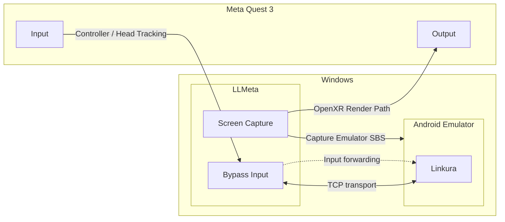

[日本語READMEはこちら](./docs/ja/README.md)

# LLMeta

The client for Linkura VR

# Disclaimer

All code and resources included in this repository are published solely for developers' learning and reference purposes. The author makes no warranties of any kind regarding the accuracy, completeness, or fitness of this code or these resources for any particular purpose. The author shall bear no responsibility whatsoever for any direct or indirect consequences, damages, losses, or legal liabilities arising from the use of this code. All risks associated with its use are to be borne solely by the user.

# Architecture Diagram

# Contribution

This project is currently in the alpha stage, so contributions are welcome!

# Development Environment

- Windows 11 26H2
- Visual Studio Code
- Meta Quest 3

# Special Thanks

- [linkura-localify](https://github.com/ChocoLZS/linkura-localify)
