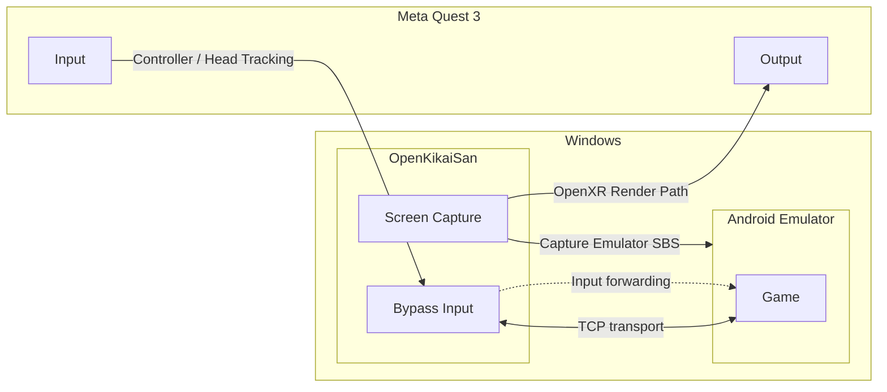

  

<h1 align="center">OpenKikaiSan</h1>

The client for OpenKikai System.

  

  <a href="./docs/ja/README.md">日本語版READMEはこちら</a>

# What is OpenKikai System?

OpenKikai System is a term for a lightweight and customizable VR streaming solution designed for fast video transfer. It is built as a thin implementation so developers can adapt, extend, and integrate it for their own environments and use cases.

# Disclaimer

This repository itself contains original implementation and resources intended for lawful development, learning, and reference purposes. The author is not responsible for any third-party software, applications, content, or environments used together with this repository, including their legality, safety, compatibility, licensing status, or resulting consequences. Users are solely responsible for evaluating and complying with the terms, laws, and risks related to any external tools or services they choose to combine with it.

# Architecture Diagram

# Development Environment

- Windows 11 26H2
- Visual Studio Code
- Meta Quest 3

# Future Plans
- Support other VR formats
- Support other connection protocols
