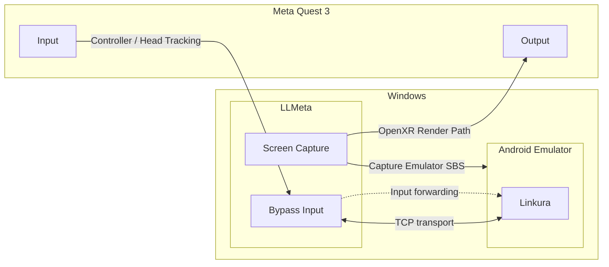

# LLMeta

リンクラVRのためのクライアント

# 免責事項

このリポジトリに含まれるすべてのコードおよびリソースは、開発者による学習および参考を目的としてのみ公開されています。作者は、これらのコード等の正確性、完全性、または特定の目的への適合性について、いかなる保証も行いません。本コードを利用したことによって生じた直接的または間接的な結果、損害、損失、または法的責任について、作者は一切の責任を負いません。利用に伴うすべてのリスクは、使用者自身の責任において負担するものとします。

# アーキテクチャ図

# コントリビューション
このプロジェクトは現在アルファ段階のため、コントリビューションは歓迎します！

# 開発環境
- Windows 11 26H2
- Visual Studio Code
- Meta Quest 3

# スペシャルサンクス
- [linkura-localify](https://github.com/ChocoLZS/linkura-localify)
