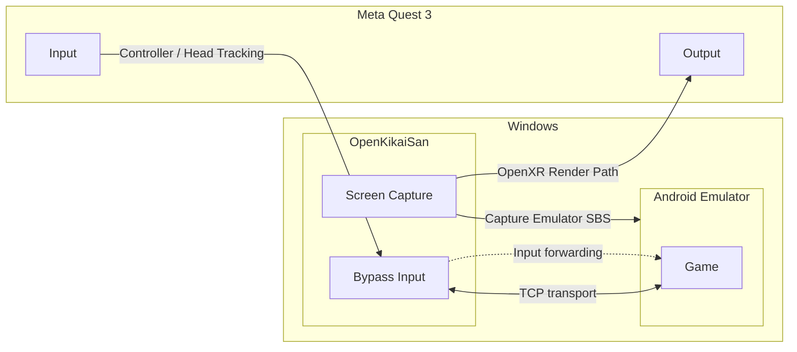

  

<h1 align="center">OpenKikaiSan</h1>

OpenKikai Systemのためのクライアント。

  

  <a href="../../README.md">English version of the README is available here</a>

# OpenKikai Systemとは？

OpenKikai Systemは、高速な映像転送を目的として設計された、軽量でカスタマイズ可能なVRストリーミングソリューションの総称です。薄い実装として構成されているため、開発者はそれぞれの環境や用途に合わせて適応、拡張、統合することができます。

# 免責事項

このリポジトリ自体には、開発、学習、参考を目的としたオリジナルの実装およびリソースが含まれています。一方で、このリポジトリと組み合わせて使用される第三者製のソフトウェア、アプリケーション、コンテンツ、利用環境については、その適法性、安全性、互換性、ライセンス状況、およびそれによって生じる結果も含めて、作者は一切の責任を負いません。外部ツールやサービスを組み合わせて使用する場合の判断、規約遵守、法令遵守、およびリスクの負担は、すべて利用者自身の責任で行ってください。

# アーキテクチャ図

# 開発環境
- Windows 11 26H2
- Visual Studio Code
- Meta Quest 3

# 今後の予定
- 他のVR形式への対応
- 他の接続プロトコルへの対応
